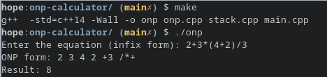

#### ONP Calculator 
---

Odwrotna notacja polska (ONP) - Reverse Polish notation (RPN)

 

###### How does it work
The program converts arithmetic expression written in the infix form to ONP form and calculates the result in respect to order of operations

 

###### Example

